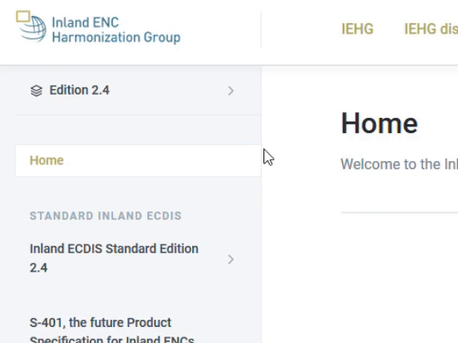

# How to ?

## Structure of the IEHG documentation


The top menu helps you to navigate through the different content related to the IEHG.

The top menu is not shown on mobile and tablets, please use the links below to lead you the content you are looking for.


The general content \(about IEHG and Inland ENCs, meeting minutes, presentations, ToR, links and papers\) is located in the [IEHG general documentation](https://ienc.gitbook.io/ienc/) \(IEHG in the top menu\).

You can access to all ECDIS standard editions on the Inland ECDIS [Standard documentation](https://ienc.gitbook.io/ienc-editions/) \(Inland ECDIS Standard Editions in the top menu\).

The [discussion forum of IEHG](https://iehg.centralus.cloudapp.azure.com/login) is used as a sharing portal for the members, following the link you can sign up and follow the discussions or submit a change request \(IEHG discussion forum in the top menu\).

## Content

If you want to know more about the ECDIS Standard Edition 2.1 :



## Switch between Editions of the ECDIS Standard

