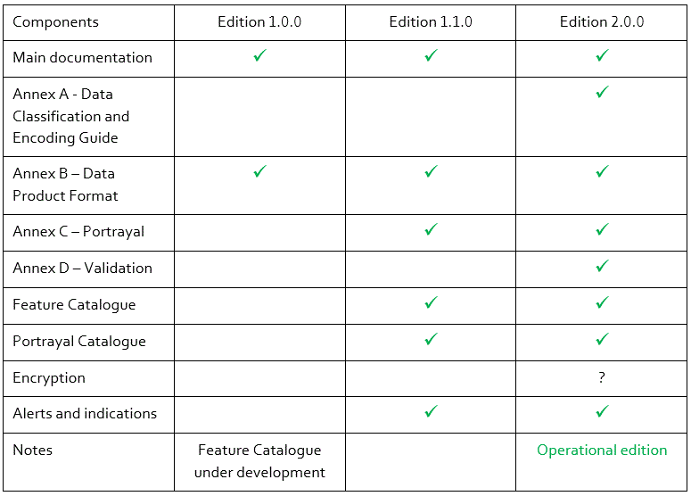

# S-401, the future Product Specification for Inland ENCs

IEHG is developing a product specification for Inland ENCs that is based on [S-100, the universal hydrographic data model of the International Hydrographic Organization \(IHO\)](http://s100.iho.int/S100/), and [S-101, the future IHO ENC Product Specification](http://registry.iho.int/beta/productspec/view.do?idx=78&product_ID=S-101&statusS=5&domainS=ALL&category=product_ID&searchValue=).

IEHG has adopted an edition 1.0.0 of S-401 that is intended as a basis for testing and further developments. Like edition 1.0.0 of S-101 it is not complete and is not intended for operational use. The following table provides an overview of the planned editions:

The development of editions 1.1.0 and 2.0.0 is depending on the availability of the respective editions of S-101.

Please take into account that the development of the missing parts might lead to corrections in the published edition.



